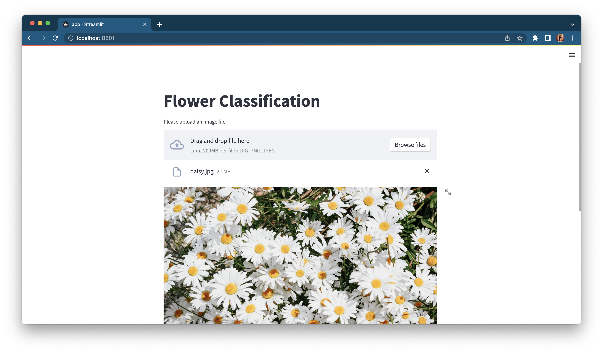
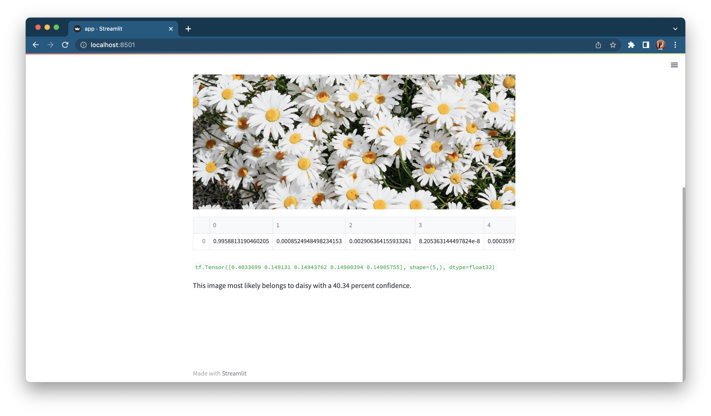

# Flower Classification Web Application :sunflower:

A deep learning web application to identify images of various flowers and classify them.
The web application uses Streamlit.

Web App screenshots:

